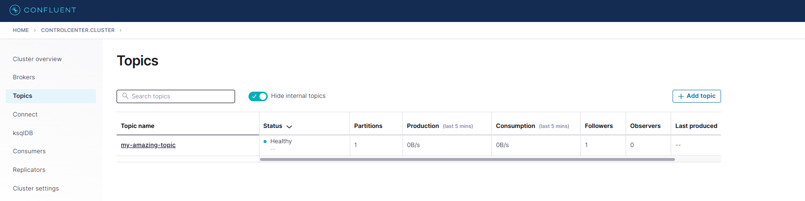
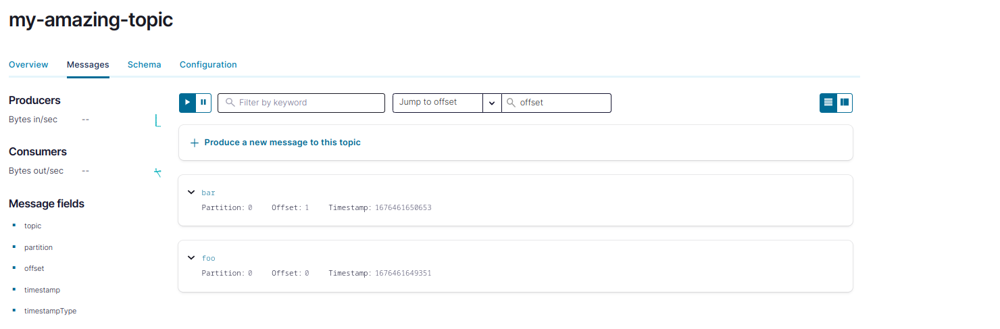

<br>

[![Button Acosom]][LinkAcosom] [![Button Twitter]][LinkTwitter] [![Button Linkedin]][LinkLinkedin]

<br>

We show how to run a local Kafka cluster using [Docker](https://www.docker.com/) containers. We will also show how to produce and consume events from Kafka using the CLI.

## :desktop_computer: The Infrastructure

The cluster is set up using [Confluent](https://hub.docker.com/u/confluentinc) images. In particular, we set up 4 services:

1. Zookeeper
2. Kafka Server (the broker)
3. Confluent Schema Registry (for use in later article...)
4. Confluent Control Center (the UI to interact with the cluster)

Note that Kafka 3.4 introduces the capability to move a Kafka cluster from Zookeeper to KRaft mode. At the time this article is written, Confluent still has not released the new Docker image with Kafka 3.4. As such, we still use Zookeeper in this tutorial. For a discussion about Zookeeper and KRaft, refer to [this article](https://www.confluent.io/blog/kafka-without-zookeeper-a-sneak-peek/).

Services will be powered up and orchestrated using docker-compose. Let us quickly review the configurations.

### Zookeeper

As usual, we need to attach [Zookeeper](https://zookeeper.apache.org/) to our Kafka cluster. Zookeeper is responsible for storing metadata regarding the cluster (e.g. where partitions live, which replica is the leader, etc...). This "extra" service that always needs to be started alongside a Kafka cluster will soon be deprecated; as metadata management will be fully internalized in the Kafka cluster, using the new Kafka Raft Metadata mode, shortened to KRaft.

Confluent's implementation of Zookeeper provides a few configurations, available [here](https://docs.confluent.io/platform/current/installation/docker/config-reference.html#zk-configuration).

In particular, We need to tell Zookeper on which port to listen to connections from clients, in our case Apache Kafka. This is configured with the key `ZOOKEEPER_CLIENT_PORT`. Once this port is chosen, expose the corresponding port in the container. This configuration alone is enough to enable communication between the Kafka cluster and Zookeeper. The corresponding configuration is available below, as used in our [docker-compose](https://github.com/theodorecurtil/kafka_101/blob/main/docker-compose.yaml) file.

```
version: '3.3'
services:
  zookeeper:
    image: confluentinc/cp-zookeeper:7.2.1
    hostname: zookeeper
    container_name: zookeeper
    ports:
      - "2181:2181"
    environment:
      ZOOKEEPER_CLIENT_PORT: 2181

  broker:
    ...
  schema-registry:
    ...
  control-center:
    ...
```

### Kafka Server

We also need to configure a single Kafka broker, with a minimum viable configuration. We need to specify the port mappings, and the networking settings (Zookeeper, advertised listeners, etc...). In addition, we set some basic logging and metrics configurations.

Details about the configuration can be found on [Confluent website](https://docs.confluent.io/platform/current/installation/docker/config-reference.html#confluent-enterprise-ak-configuration); and all configurations can be found [here](https://docs.confluent.io/platform/current/installation/configuration/broker-configs.html#ak-broker-configurations-for-cp).

```
version: '3.3'
services:
  zookeeper:
    ...
  broker:
    image: confluentinc/cp-server:7.2.1
    hostname: broker
    container_name: broker
    depends_on:
      - zookeeper
    ports:
      - "9092:9092"
      - "29092:29092"
    environment:
      KAFKA_BROKER_ID: 1
      KAFKA_ZOOKEEPER_CONNECT: 'zookeeper:2181'
      KAFKA_LISTENER_SECURITY_PROTOCOL_MAP: PLAINTEXT:PLAINTEXT,PLAINTEXT_HOST:PLAINTEXT
      KAFKA_LOG4J_LOGGERS: org.apache.zookeeper=ERROR,org.apache.kafka=ERROR, kafka=ERROR, kafka.cluster=ERROR,kafka.controller=ERROR, kafka.coordinator=ERROR,kafka.log=ERROR,kafka.server=ERROR,kafka.zookeeper=ERROR,state.change.logger=ERROR
      KAFKA_LOG4J_ROOT_LOGLEVEL: ERROR
      KAFKA_ADVERTISED_LISTENERS: PLAINTEXT://broker:29092,PLAINTEXT_HOST://localhost:9092
      KAFKA_METRIC_REPORTERS: io.confluent.metrics.reporter.ConfluentMetricsReporter
      KAFKA_OFFSETS_TOPIC_REPLICATION_FACTOR: 1
      KAFKA_CONFLUENT_SCHEMA_REGISTRY_URL: http://schema-registry:8081
      CONFLUENT_METRICS_REPORTER_BOOTSTRAP_SERVERS: broker:29092
      CONFLUENT_METRICS_ENABLE: 'true'

  schema-registry:
    ...
  control-center:
    ...
```

## :zap: Start the Cluster

To start the cluster, start by cloning the repo; and `cd` into the repository, locally.

> :warning: Make sure that ports that will be mapped from localhost are not already used; and that you do not have running containers with same names as the ones defined in our [docker-compose.yaml](https://github.com/theodorecurtil/kafka_101/blob/main/docker-compose.yaml) file (check the `container_name` configuration key).

```console
git clone git@github.com:theodorecurtil/kafka_101.git
cd kafka_101
```

To start the cluster, simply run the command

```console
docker-compose up -d
```

Depending on the Docker version you have, the command might be

```console
docker compose up -d
```

To check that all services are started, type the command

```console
docker-compose ps
```

The output should be

```console
NAME                IMAGE                                             COMMAND                  SERVICE             CREATED             STATUS              PORTS
broker              confluentinc/cp-server:7.2.1                      "/etc/confluent/dock…"   broker              9 seconds ago       Up 7 seconds        0.0.0.0:9092->9092/tcp, :::9092->9092/tcp, 0.0.0.0:9101->9101/tcp, :::9101->9101/tcp, 0.0.0.0:29092->29092/tcp, :::29092->29092/tcp
control-center      confluentinc/cp-enterprise-control-center:7.2.1   "/etc/confluent/dock…"   control-center      9 seconds ago       Up 6 seconds        0.0.0.0:9021->9021/tcp, :::9021->9021/tcp
schema-registry     confluentinc/cp-schema-registry:7.2.1             "/etc/confluent/dock…"   schema-registry     9 seconds ago       Up 7 seconds        0.0.0.0:8081->8081/tcp, :::8081->8081/tcp
zookeeper           confluentinc/cp-zookeeper:7.2.1                   "/etc/confluent/dock…"   zookeeper           9 seconds ago       Up 7 seconds        2888/tcp, 0.0.0.0:2181->2181/tcp, :::2181->2181/tcp, 3888/tcp
```

You should now be able to access the `control-center` container, which is the Confluent UI for Kafka cluster management on [localhost:9021](http://localhost:9021/). Please refer to online ressources for a guided tour of [Confluent control center](https://docs.confluent.io/platform/current/control-center/overview.html#c3).

## :recycle: Produce and Consume Messages using the CLI

With Kafka, there are the notions of [Producers](https://docs.confluent.io/platform/current/clients/producer.html) and [Consumers](https://docs.confluent.io/platform/current/clients/consumer.html). Simply put, producers are client applications writing data to the cluster, and consumers are applications reading data from the cluster. Consumers are ultimately doing the work from the data they read (e.g. a Flink application would be a consumer).

Confluent provides CLI tools to produce and consume messages from the command line. In this section, we will see the following:

1. Create a topic
2. Write (produce) to the topcic
3. Read (consume) from the topic

To access the CLI tools, we need to enter the `broker` container.

```console
docker exec -it broker bash
```

### Create a Topic

For this example, we will create a simple topic in the cluster, with default configurations. We will create a topic named `my-amazing-topic` with a replication factor of 1 and a partitioning of 1. This means that messages will be not be replicated (1 message is only stored in one server) and will not be partitioned (1 partition is same as no partitioning). This means that the topic will be sharded in 1 log.

To instantiate this topic; run the following command from within the `broker` container

```console
kafka-topics --bootstrap-server localhost:9092 --create --topic my-amazing-topic --partitions 1 --replication-factor 1
```

If the command succeeds, it will output

```console
Created topic my-amazing-topic.
```

One can also check that the topic was successfully created by navigating to the Topics tab of the web UI; where the newly created topic should be listed with the *Healthy* status.



### Produce to the Topic

Now that we have a topic created with a default configuration, we can start producing records to it! Still from within the container, run the following command, and send your messages.

```console
[appuser@broker ~]$ kafka-console-producer --bootstrap-server localhost:9092 --topic my-amazing-topic
>foo
>bar
```

This command will produce 2 messages to the topic `my-amazing-topic` without a key, and with values `foo` and `bar`, some strings.

One can see that the messages were produced to the topic and are persisted in the topic by navigating to the `Topics` tab.



If you click on the `Schema` tab, you will notice that no schema is present. This means that the topic can contain records with different schema, like strings or json strings. No schema is enforced; which is obviously not a good practice in production; hence the need for the `schema-registry` container. But do not worry about it now, we will touch that point in our next blog post where we will be building a small producer application pushing Avro records to Kafka, with schema validation.

### Consume from the Topic

The final step is to consume the messages we just produced, from the topic. To do that, type the following command from within the container

```console
[appuser@broker ~]$ kafka-console-consumer --bootstrap-server localhost:9092 --topic my-amazing-topic --from-beginning
foo
bar
```

## :arrow_down: Kill the Cluster

Once you have played enough with your Kafka cluster, you might want to bring it down. To do this, `cd` into this project repo again and docker-compose down the infrastructure.

```console
cd kafka_101
docker-compose down
```

## :next_track_button: What is Coming Next?

In a next blog post, we will see how to - starting from this vanilla Kafka infra - produce avro records to Kafka. Stay tuned! :tv:

<!---------------------------------------------------------------------------->

[Button Acosom]: https://img.shields.io/badge/Acosom-Read%20blog%20post-orange
[Button Twitter]: https://img.shields.io/twitter/follow/theodore_curtil?style=social
[Button Linkedin]: https://img.shields.io/badge/LinkedIn-Follow%20Acosom-blue

[LinkAcosom]: https://acosom.com/blog/getting-started-with-confluents-kafka?utm_source=github&utm_medium=social&utm_campaign=blog 'Read on acosom.com'
[LinkTwitter]: https://twitter.com/theodore_curtil 'Follow me on Twitter :)'
[LinkLinkedin]: https://ch.linkedin.com/company/acosom 'Follow us on LinkedIn :)'